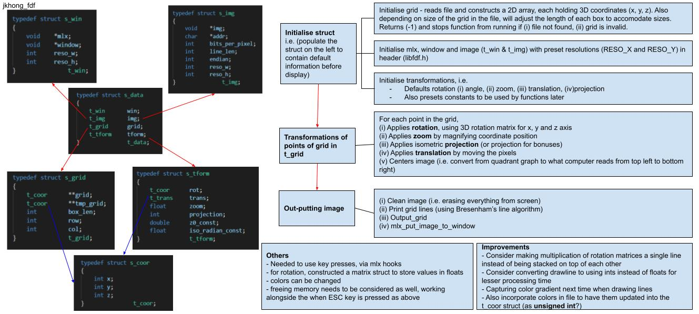

## **FDF**

- [**FDF**](#fdf)
	- [**Steps to execute program**](#steps-to-execute-program)
	- [**Program overview/flowchart**](#program-overviewflowchart)
	- [**Learnings**](#learnings)

### **Steps to execute program**
Tested for window users with WSL2 
1. Launch XLaunch
2. Display settings

		Multiple windows
		Display number: 0

3. Select how to start Xming

		Start no client

4. Specify parameter settings

		Tick: No Access Control

5. Finish
   
6. Run the following in command line in your WSL to save IP address to 'DISPLAY' environment variable
   - WSL2

			export DISPLAY=$(cat /etc/resolv.conf | grep nameserver | awk '{print $2}'):0.0

   - WSL1

			export DISPLAY=localhost:0.0 (WSL1)

### **Program overview/flowchart**

### **Learnings**
1. [Downloading miniLibX for Linux/WSL](https://github.com/42Paris/minilibx-linux)

2. [Introduction to miniLibX](https://harm-smits.github.io/42docs/libs/minilibx/getting_started.html#writing-pixels-to-a-image), covers the following:
   - Initialising mlx
   - Opening an mlxwindow
   - Showing an image
     - initialising a new image
     - writing pixels to the image
   - Hooks & Loops

3. Line drawing algorithms
   1. Bresenham's line algorithm
      - [Wikipedia](https://en.wikipedia.org/wiki/Bresenham%27s_line_algorithm)
      - [Detailed mathematical derivation of formula](https://www.youtube.com/watch?v=RGB-wlatStc)
      - [Extension of breseham's algorithm to all quadrants, x and y plane, and to handle ordering of coordinates](https://www.youtube.com/watch?v=H1RtMA3XV3k&ab_channel=AbdulBariAbdulBariVerified)
      - [More references from University of Helsinki](https://www.cs.helsinki.fi/group/goa/mallinnus/lines/bresenh.html#:~:text=Bresenham%20for%20negative%20slopes,error%2C%20%2C%20associated%20with%20y.)
	2. Xiaolin Wu's line algorithm
         - [Wikipedia](https://en.wikipedia.org/wiki/Xiaolin_Wu%27s_line_algorithm)

4. Vectors, matrices, transformations, and matrix multiplication
   - [Playlist by 3Blue1Brown](https://www.youtube.com/playlist?list=PLZHQObOWTQDPD3MizzM2xVFitgF8hE_ab) 

5. Rotational matrices
- [Wikipedia](https://en.wikipedia.org/wiki/Rotation_matrix)
   1. 2D
		- [Example of derivation for 2D plane rotation](https://www.youtube.com/watch?v=OYuoPTRVzxY&t=2s)
   2. 3D
         - [Rotations in 3D](https://www.youtube.com/watch?v=wg9bI8-Qx2Q&t=75s)

6. [Building a 3D cube](https://www.youtube.com/watch?v=UZcfoc_nom4)

