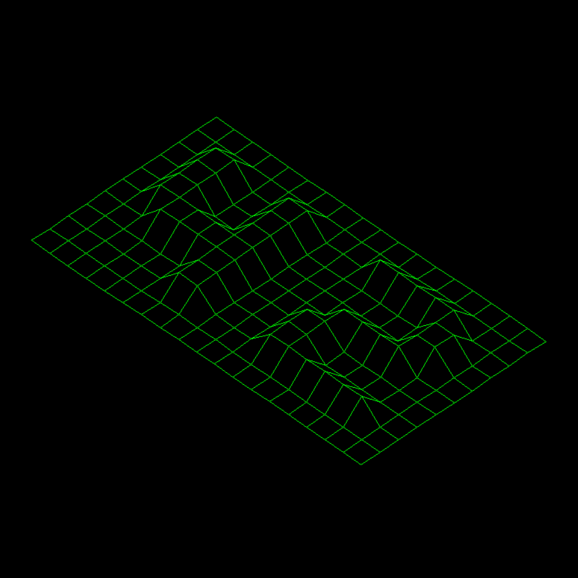

## **FDF**

- [**FDF**](#fdf)
  - [**Steps to execute program**](#steps-to-execute-program)
  - [**Program overview/flowchart**](#program-overviewflowchart)
  - [**File organisation**](#file-organisation)
    - [<ins>Main</ins>](#insmainins)
    - [<ins>Initialisation</ins>](#insinitialisationins)
    - [<ins>Transformations</ins>](#instransformationsins)
    - [<ins>Display</ins>](#insdisplayins)
  - [**Learnings**](#learnings)

### **Steps to execute program**
Tested for window users with WSL2 
1. Launch XLaunch
2. Display settings

		Multiple windows
		Display number: 0

3. Select how to start Xming

		Start no client

4. Specify parameter settings

		Tick: No Access Control

5. Finish
   
6. Run the following in command line in your WSL to save IP address to 'DISPLAY' environment variable
   - WSL2

			export DISPLAY=$(cat /etc/resolv.conf | grep nameserver | awk '{print $2}'):0.0

   - WSL1

			export DISPLAY=localhost:0.0 (WSL1)

7. Command

         ./fdf <filename>

8. Key commands

         J: Rotate x axis 5 deg
         I: Rotate x axis -5 deg
         K: Rotate y axis 5 deg
         O: Rotate y axis -5 deg
         L: Rotate z axis 5 deg
         P: Rotate z axis -5 deg
         H: Zoom in
         U: Zoom out
         WASD: Transform grid up, down, left, right
         Q: Switch projection between isometric/perspective
         ESC: Quit program

### **Program overview/flowchart**

### **File organisation**
- Source files to be referenced in the src/ folder.
#### <ins>Main</ins>
- `fdf_main.c` main() file: reads user command line input, handle keyboard input/hooks, and frees memory.
#### <ins>Initialisation</ins>
- `initialise.c`: initialisation of (i) mlx, (ii) grid (iii) transformations.
- `make_grid.c`, `make_grid_utils.c`: extensions of grid initialisation from initialise.c, actual functions to update struct of allocated grid.
#### <ins>Transformations</ins>
- `transformation.c`: applies transformations to grid prior to display to mlx image, also include function for zoom, translate & center/
- `rotation.c`: rotational matrix functions for all 3 axes, and consolidated rotation function to be used in transformation.c.
- `projection.c`: formula and function for perspective and isometric projection to be used in transformation.c.
#### <ins>Display</ins>
- `make_line.c`, `make_line_utils.c`: application of Bresenham's line drawing algorithm. Within utils, includes an alternative function to mlx_put_pixel, where instead I've put pixels directly to mlx image instead.
- `print and process`: output_grid function to be executed after initialisation, within: 
  - (i) first cleans image
  - (ii) copies grid to temp memory
  - (iii) applies transformation
  - (iv) print grid lines on mlx image, and
  - (iv) displays mlx image 

### **Learnings**
1. [Downloading miniLibX for Linux/WSL](https://github.com/42Paris/minilibx-linux)

2. [Introduction to miniLibX](https://harm-smits.github.io/42docs/libs/minilibx/getting_started.html#writing-pixels-to-a-image), covers the following:
   - Initialising mlx
   - Opening an mlxwindow
   - Showing an image
     - initialising a new image
     - writing pixels to the image
   - Hooks & Loops

3. Line drawing algorithms
   1. Bresenham's line algorithm
      - [Wikipedia](https://en.wikipedia.org/wiki/Bresenham%27s_line_algorithm)
      - [Detailed mathematical derivation of formula](https://www.youtube.com/watch?v=RGB-wlatStc)
      - [Extension of breseham's algorithm to all quadrants, x and y plane, and to handle ordering of coordinates](https://www.youtube.com/watch?v=H1RtMA3XV3k&ab_channel=AbdulBariAbdulBariVerified)
      - [More references from University of Helsinki](https://www.cs.helsinki.fi/group/goa/mallinnus/lines/bresenh.html#:~:text=Bresenham%20for%20negative%20slopes,error%2C%20%2C%20associated%20with%20y.)
	2. Xiaolin Wu's line algorithm
         - [Wikipedia](https://en.wikipedia.org/wiki/Xiaolin_Wu%27s_line_algorithm)

4. Vectors, matrices, transformations, and matrix multiplication
   - [Playlist by 3Blue1Brown](https://www.youtube.com/playlist?list=PLZHQObOWTQDPD3MizzM2xVFitgF8hE_ab) 

5. Rotational matrices
- [Wikipedia](https://en.wikipedia.org/wiki/Rotation_matrix)
   1. 2D
		- [Example of derivation for 2D plane rotation](https://www.youtube.com/watch?v=OYuoPTRVzxY&t=2s)
   2. 3D
         - [Rotations in 3D](https://www.youtube.com/watch?v=wg9bI8-Qx2Q&t=75s)

6. [Building a 3D cube](https://www.youtube.com/watch?v=UZcfoc_nom4)

